# SQLpraktikum4


```
Nama    : fakhri afif muhaimin
NIM     : 312310632
Kelas   : TI.23.A6
Matkul  : Basis Data
Dosen   : Agung Nugroho, S.Kom., M.Kom.
```

## Query Filtering

- Soal :


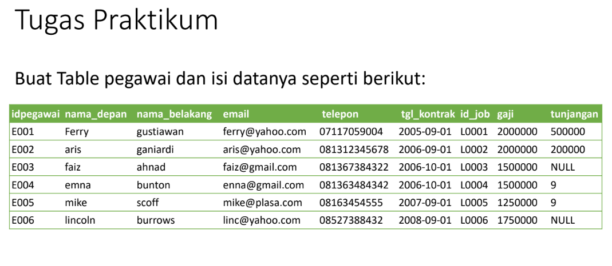

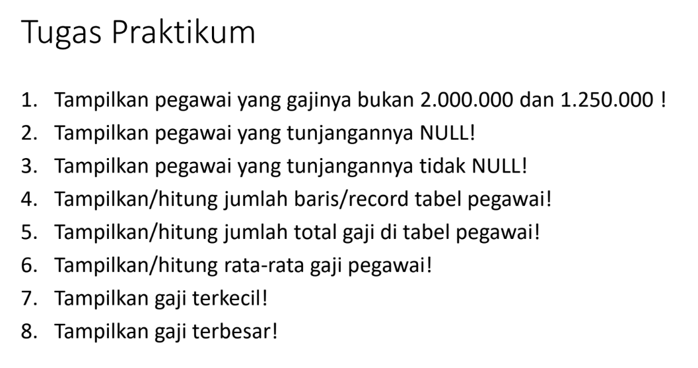


## membuat table terlebih dahulu

Berikut adalah contoh pembuatan tabel pegawai beserta isinya menggunakan kode SQL:

```sql
CREATE TABLE pegawai (
  idpegawai VARCHAR(10),
  nama_depan VARCHAR(50),
  nama_belakang VARCHAR(50),
  email VARCHAR(100),
  telepon VARCHAR(15),
  tgl_kontrak DATE,
  id_job VARCHAR(10),
  gaji INT,
  tunjangan INT
);

INSERT INTO pegawai (idpegawai, nama_depan, nama_belakang, email, telepon, tgl_kontrak, id_job, gaji, tunjangan) VALUES
("E001", "Gojo", "Satoru", "gjsatoru@gmail.com", "08123456719", "2006-01-18", "10001", 2000000, 500000),
("E002", "Raja", "Iblis", "sukuna@gmail.com", "08123456710", "2005-03-28", "10002", 2000000, 200000),
("E003", "Itadori", "Yuji", "itadori@yahoo.com", "68123456711", "2004-06-17", "L0003", 1500008, NULL),
("E004", "Mugiwara", "Luffy", "mugiwara@yahoo.com", "08123456712", "2004-03-19", "10004", 1500000, 9),
("E005", "Rin", "Okumura", "okumura@gmail.com", "08123456713", "2006-03-18", "L0005", 1250000, 9),
("E006", "Megumi", "Fushiguro", "megumi@yahoo.com", "08123456714", "2002-09-17", "L0006", 1750000, NULL);
```


berikut hasil outputnya :

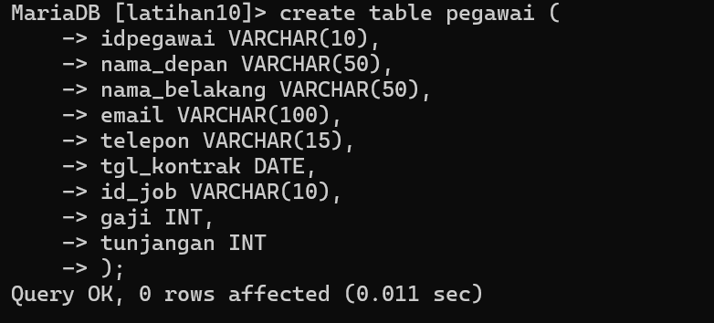
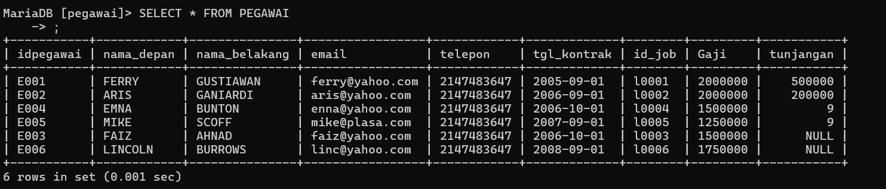


Dalam contoh di atas, kita membuat tabel `pegawai` dengan kolom-kolom yang sesuai dengan struktur yang Anda berikan. Kemudian, menggunakan perintah `INSERT INTO`, kita mengisi tabel dengan data yang diberikan dalam format yang sesuai.

1. Untuk menampilkan pegawai yang gajinya bukan 2.000.000 dan 1.250.000, Anda dapat menggunakan perintah SQL SELECT dengan klausa WHERE dan operator NOT IN. Berikut adalah contoh kode SQL untuk melakukan hal tersebut:

```sql
SELECT *
FROM pegawai
WHERE gaji NOT IN (2000000, 1250000);
```

Perintah di atas akan mengambil semua kolom (*) dari tabel "pegawai" di mana nilai gaji (kolom "gaji") tidak sama dengan 2.000.000 dan 1.250.000. Hasilnya akan mengembalikan baris-baris yang memenuhi kondisi tersebut.

Pastikan bahwa tabel "pegawai" telah ada dalam database Anda sebelum menjalankan perintah SQL di atas. Jika nama tabelnya berbeda, gantilah "pegawai" dengan nama tabel yang sesuai.

berikut hasil outputnya:


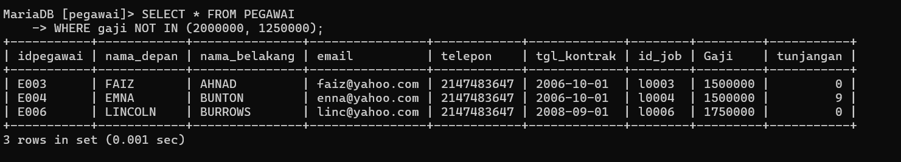


2. Untuk menampilkan pegawai yang tunjangannya NULL, Anda dapat menggunakan perintah SQL SELECT dengan klausa WHERE dan operator IS NULL. Berikut adalah contoh kode SQL untuk melakukan hal tersebut:

```sql
SELECT *
FROM pegawai
WHERE tunjangan IS NULL;
```

Perintah di atas akan mengambil semua kolom (*) dari tabel "pegawai" di mana nilai tunjangan (kolom "tunjangan") adalah NULL. Hasilnya akan mengembalikan baris-baris yang memenuhi kondisi tersebut.

Pastikan bahwa tabel "pegawai" telah ada dalam database Anda sebelum menjalankan perintah SQL di atas. Jika nama tabelnya berbeda, gantilah "pegawai" dengan nama tabel yang sesuai.


berikut hasil outputnya :


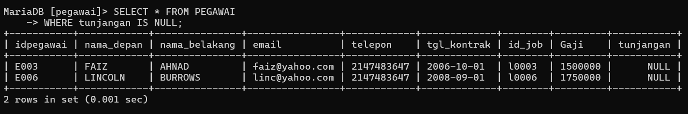


3. Untuk menampilkan pegawai yang tunjangannya tidak NULL, Anda dapat menggunakan perintah SQL SELECT dengan klausa WHERE dan operator IS NOT NULL. Berikut adalah contoh kode SQL untuk melakukan hal tersebut:

```sql
SELECT *
FROM pegawai
WHERE tunjangan IS NOT NULL;
```

Perintah di atas akan mengambil semua kolom (*) dari tabel "pegawai" di mana nilai tunjangan (kolom "tunjangan") bukan NULL. Hasilnya akan mengembalikan baris-baris yang memenuhi kondisi tersebut.

Pastikan bahwa tabel "pegawai" telah ada dalam database Anda sebelum menjalankan perintah SQL di atas. Jika nama tabelnya berbeda, gantilah "pegawai" dengan nama tabel yang sesuai.


berikut hasil outputnya :


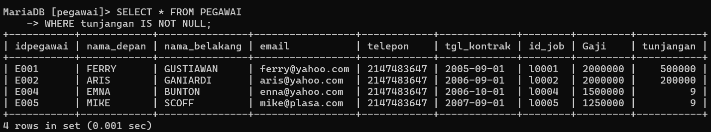


4. Untuk menampilkan atau menghitung jumlah baris atau record dalam tabel pegawai, Anda dapat menggunakan perintah SQL SELECT dengan fungsi COUNT. Berikut adalah contoh kode SQL untuk melakukannya:

```sql
SELECT COUNT(*) AS jumlah_pegawai
FROM pegawai;
```

Perintah di atas akan menghitung jumlah baris atau record dalam tabel "pegawai" menggunakan fungsi COUNT(*). Hasilnya akan mengembalikan jumlah pegawai sebagai hasil dari perhitungan tersebut.

Dalam contoh di atas, digunakan juga klausa AS untuk memberikan nama alias "jumlah_pegawai" pada kolom hasil perhitungan. Alias ini dapat digunakan untuk memberikan nama yang lebih deskriptif pada kolom hasil agar lebih mudah dibaca.

Pastikan bahwa tabel "pegawai" telah ada dalam database Anda sebelum menjalankan perintah SQL di atas. Jika nama tabelnya berbeda, gantilah "pegawai" dengan nama tabel yang sesuai.


berikut hasil outputnya:


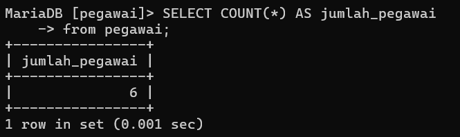


5. Untuk menghitung jumlah total gaji di tabel pegawai, Anda dapat menggunakan perintah SQL SELECT dengan fungsi agregat SUM. Berikut adalah contoh kode SQL untuk melakukannya:

```sql
SELECT SUM(gaji) AS total_gaji
FROM pegawai;
```

Perintah di atas akan menjumlahkan semua nilai dalam kolom "gaji" dari tabel "pegawai" menggunakan fungsi agregat SUM. Hasilnya akan mengembalikan jumlah total gaji sebagai hasil perhitungan tersebut.

Dalam contoh di atas, digunakan juga klausa AS untuk memberikan nama alias "total_gaji" pada kolom hasil perhitungan. Alias ini dapat digunakan untuk memberikan nama yang lebih deskriptif pada kolom hasil agar lebih mudah dibaca.

Pastikan bahwa tabel "pegawai" telah ada dalam database Anda sebelum menjalankan perintah SQL di atas. Jika nama tabelnya berbeda, gantilah "pegawai" dengan nama tabel yang sesuai.


berikut hasil outputnya :


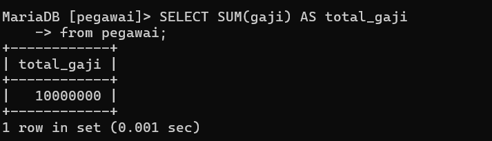


6. Untuk menghitung rata-rata gaji pegawai, Anda dapat menggunakan perintah SQL SELECT dengan fungsi agregat AVG. Berikut adalah contoh kode SQL untuk melakukannya:

```sql
SELECT AVG(gaji) AS rata_gaji
FROM pegawai;
```

Perintah di atas akan menghitung rata-rata nilai dalam kolom "gaji" dari tabel "pegawai" menggunakan fungsi agregat AVG. Hasilnya akan mengembalikan rata-rata gaji sebagai hasil perhitungan tersebut.

Dalam contoh di atas, digunakan juga klausa AS untuk memberikan nama alias "rata_gaji" pada kolom hasil perhitungan. Alias ini dapat digunakan untuk memberikan nama yang lebih deskriptif pada kolom hasil agar lebih mudah dibaca.

Pastikan bahwa tabel "pegawai" telah ada dalam database Anda sebelum menjalankan perintah SQL di atas. Jika nama tabelnya berbeda, gantilah "pegawai" dengan nama tabel yang sesuai.


berikut hasil outputnya: 


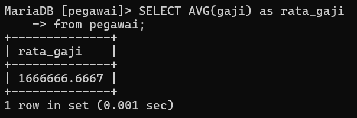


7. Untuk menampilkan gaji terkecil dari tabel pegawai, Anda dapat menggunakan perintah SQL SELECT dengan fungsi agregat MIN. Berikut adalah contoh kode SQL untuk melakukannya:

```sql
SELECT MIN(gaji) AS gaji_terkecil
FROM pegawai;
```

Perintah di atas akan mencari nilai terkecil dalam kolom "gaji" dari tabel "pegawai" menggunakan fungsi agregat MIN. Hasilnya akan mengembalikan gaji terkecil sebagai hasil perhitungan tersebut.

Dalam contoh di atas, digunakan juga klausa AS untuk memberikan nama alias "gaji_terkecil" pada kolom hasil perhitungan. Alias ini dapat digunakan untuk memberikan nama yang lebih deskriptif pada kolom hasil agar lebih mudah dibaca.

Pastikan bahwa tabel "pegawai" telah ada dalam database Anda sebelum menjalankan perintah SQL di atas. Jika nama tabelnya berbeda, gantilah "pegawai" dengan nama tabel yang sesuai.


berikut hasil outputnya :


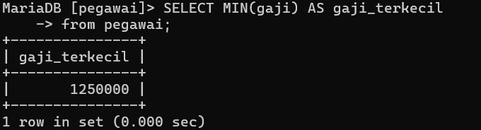


8. Untuk menampilkan gaji terbesar dari tabel pegawai, Anda dapat menggunakan perintah SQL SELECT dengan fungsi agregat MAX. Berikut adalah contoh kode SQL untuk melakukannya:

```sql
SELECT MAX(gaji) AS gaji_terbesar
FROM pegawai;
```

Perintah di atas akan mencari nilai terbesar dalam kolom "gaji" dari tabel "pegawai" menggunakan fungsi agregat MAX. Hasilnya akan mengembalikan gaji terbesar sebagai hasil perhitungan tersebut.

Dalam contoh di atas, digunakan juga klausa AS untuk memberikan nama alias "gaji_terbesar" pada kolom hasil perhitungan. Alias ini dapat digunakan untuk memberikan nama yang lebih deskriptif pada kolom hasil agar lebih mudah dibaca.

Pastikan bahwa tabel "pegawai" telah ada dalam database Anda sebelum menjalankan perintah SQL di atas. Jika nama tabelnya berbeda, gantilah "pegawai" dengan nama tabel yang sesuai.


berikut hasil outputnya :


# - Tugas peraktikum ke 2


seperti sebelumnya, kita akan membuat tabel terlebih dahulu dengan perintah berikut : 

Berikut adalah skrip SQL untuk membuat tabel "hewan" dan mengisinya dengan data yang diberikan:

```sql
CREATE TABLE hewan (
  id VARCHAR(2),
  name VARCHAR(10),
  owner VARCHAR(10),
  species VARCHAR(10),
  sex CHAR(1)
);

INSERT INTO hewan (id, name, owner, species, sex)
VALUES
  ('p1', 'Puffball', 'Diane', 'Hamster', 'f'),
  ('p2', 'Claws', 'Gwen', 'Cat', 'm'),
  ('p3', 'Fluffy', 'Haro 1d', 'Cat', 'f'),
  ('p4', 'Buffy', 'Haro 1d', 'Dog', 'f'),
  ('p5', 'Fang', 'Benny', 'Dog', 'm'),
  ('p6', 'Bowser', 'Diane', 'Dog', 'm'),
  ('p7', 'Chirpy', 'Gwen', 'Bird', 'f'),
  ('p8', 'Whistler', 'Gwen', 'Bird', NULL),
  ('p9', 'Slim', 'Benny', 'Snake', 'm');
```

Perintah di atas akan membuat tabel "hewan" dengan kolom-kolom yang sesuai, yaitu "id", "name", "owner", "species", dan "sex". Kemudian, perintah INSERT INTO digunakan untuk mengisikan data ke dalam tabel tersebut.

berikut hasil outputnya : 


lanjut ke perintah tugas praktikumnya :
1. Untuk menampilkan jumlah hewan yang dimiliki setiap owner, Anda dapat menggunakan perintah SQL SELECT dengan klausa GROUP BY dan fungsi agregat COUNT. Berikut adalah contoh kode SQL untuk melakukannya:

```sql
SELECT owner, COUNT(*) AS jumlah_hewan
FROM hewan
GROUP BY owner;
```

Perintah di atas akan mengambil kolom "owner" dari tabel "hewan" dan menghitung jumlah baris atau record yang memiliki nilai owner yang sama menggunakan fungsi agregat COUNT. Hasilnya akan mengembalikan jumlah hewan yang dimiliki oleh setiap owner.

Dalam contoh di atas, digunakan juga klausa AS untuk memberikan nama alias "jumlah_hewan" pada kolom hasil perhitungan. Alias ini dapat digunakan untuk memberikan nama yang lebih deskriptif pada kolom hasil agar lebih mudah dibaca.


berikut hasil outputnya :


2. Untuk menampilkan jumlah hewan berdasarkan spesies, Anda dapat menggunakan perintah SQL SELECT dengan klausa GROUP BY dan fungsi agregat COUNT. Berikut adalah contoh kode SQL untuk melakukannya:

```sql
SELECT species, COUNT(*) AS jumlah_hewan
FROM hewan
GROUP BY species;
```

Perintah di atas akan mengambil kolom "species" dari tabel "hewan" dan menghitung jumlah baris atau record yang memiliki nilai spesies yang sama menggunakan fungsi agregat COUNT. Hasilnya akan mengembalikan jumlah hewan berdasarkan spesies.

Dalam contoh di atas, digunakan juga klausa AS untuk memberikan nama alias "jumlah_hewan" pada kolom hasil perhitungan. Alias ini dapat digunakan untuk memberikan nama yang lebih deskriptif pada kolom hasil agar lebih mudah dibaca.


berikut hasil outputnya :


3. Untuk menampilkan jumlah hewan berdasarkan jenis kelamin, Anda dapat menggunakan perintah SQL SELECT dengan klausa GROUP BY dan fungsi agregat COUNT. Berikut adalah contoh kode SQL untuk melakukannya:

```sql
SELECT sex, COUNT(*) AS jumlah_hewan
FROM hewan
GROUP BY sex;
```

Perintah di atas akan mengambil kolom "sex" dari tabel "hewan" dan menghitung jumlah baris atau record yang memiliki jenis kelamin yang sama menggunakan fungsi agregat COUNT. Hasilnya akan mengembalikan jumlah hewan berdasarkan jenis kelamin.

Dalam contoh di atas, digunakan juga klausa AS untuk memberikan nama alias "jumlah_hewan" pada kolom hasil perhitungan. Alias ini dapat digunakan untuk memberikan nama yang lebih deskriptif pada kolom hasil agar lebih mudah dibaca.


berikut hasil outputnya:


4. Untuk menampilkan jumlah hewan berdasarkan spesies dan jenis kelamin, Anda dapat menggunakan perintah SQL SELECT dengan klausa GROUP BY dan fungsi agregat COUNT. Berikut adalah contoh kode SQL untuk melakukannya:

```sql
SELECT species, sex, COUNT(*) AS jumlah_hewan
FROM hewan
GROUP BY species, sex;
```

Perintah di atas akan mengambil kolom "species" dan "sex" dari tabel "hewan" dan menghitung jumlah baris atau record yang memiliki kombinasi spesies dan jenis kelamin yang sama menggunakan fungsi agregat COUNT. Hasilnya akan mengembalikan jumlah hewan berdasarkan spesies dan jenis kelamin.

Dalam contoh di atas, digunakan juga klausa AS untuk memberikan nama alias "jumlah_hewan" pada kolom hasil perhitungan. Alias ini dapat digunakan untuk memberikan nama yang lebih deskriptif pada kolom hasil agar lebih mudah dibaca.


berikut hasil outputnya :


5. Untuk menampilkan jumlah hewan berdasarkan spesies (cat dan dog saja) dan jenis kelamin, Anda dapat menggunakan perintah SQL SELECT dengan klausa WHERE untuk memfilter spesies yang diinginkan, serta klausa GROUP BY dan fungsi agregat COUNT. Berikut adalah contoh kode SQL untuk melakukannya:

```sql
SELECT species, sex, COUNT(*) AS jumlah_hewan
FROM hewan
WHERE species IN ('Cat', 'Dog')
GROUP BY species, sex;
```

Perintah di atas akan mengambil kolom "species" dan "sex" dari tabel "hewan", memfilter hanya spesies yang sama dengan 'Cat' atau 'Dog', dan menghitung jumlah baris atau record yang memiliki kombinasi spesies dan jenis kelamin yang sama menggunakan fungsi agregat COUNT. Hasilnya akan mengembalikan jumlah hewan berdasarkan spesies (Cat dan Dog) dan jenis kelamin.

Dalam contoh di atas, digunakan juga klausa AS untuk memberikan nama alias "jumlah_hewan" pada kolom hasil perhitungan. Alias ini dapat digunakan untuk memberikan nama yang lebih deskriptif pada kolom hasil agar lebih mudah dibaca.


berikut hasil outputnya:


6. Untuk menampilkan jumlah hewan berdasarkan jenis kelamin yang diketahui saja, Anda dapat menggunakan perintah SQL SELECT dengan klausa WHERE untuk memfilter data berdasarkan jenis kelamin yang tidak NULL, serta klausa GROUP BY dan fungsi agregat COUNT. Berikut adalah contoh kode SQL untuk melakukannya:

```sql
SELECT sex, COUNT(*) AS jumlah_hewan
FROM hewan
WHERE sex IS NOT NULL
GROUP BY sex;
```

Perintah di atas akan mengambil kolom "sex" dari tabel "hewan", memfilter data hanya untuk jenis kelamin yang tidak NULL (yang diketahui), dan menghitung jumlah baris atau record yang memiliki jenis kelamin yang sama menggunakan fungsi agregat COUNT. Hasilnya akan mengembalikan jumlah hewan berdasarkan jenis kelamin yang diketahui.

Dalam contoh di atas, digunakan juga klausa AS untuk memberikan nama alias "jumlah_hewan" pada kolom hasil perhitungan. Alias ini dapat digunakan untuk memberikan nama yang lebih deskriptif pada kolom hasil agar lebih mudah dibaca.

Pastikan bahwa tabel "hewan" telah ada dalam database Anda sebelum menjalankan perintah SQL di atas. Jika nama tabelnya berbeda, gantilah "hewan" dengan nama tabel yang sesuai.


berikut hasil outputnya :


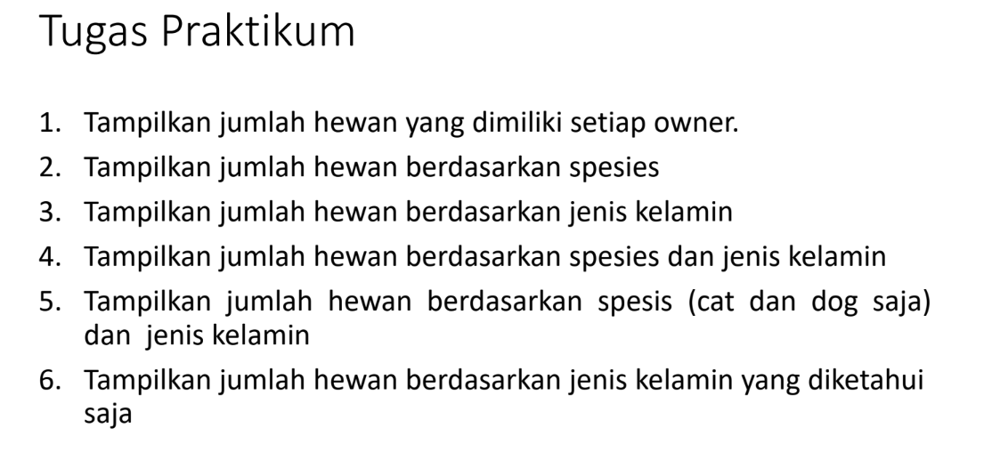


## Evaluasi dan Pertanyaan

- Tulis semua perintah-perintah SQL percobaan di atas beserta
outputnya!

terlampir diatas

- Beri kesimpulan Anda!


1. Filter Kondisi: Operator relasi (=, >, <, >=, <=, <>) digunakan untuk membandingkan antara dua nilai. Operator BETWEEN digunakan untuk memfilter data dalam rentang tertentu. Operator LIKE atau NOT LIKE digunakan untuk mencari data dengan menggunakan wildcard (_ atau %).

2. Operator IN dan IS NULL: Operator IN digunakan untuk memfilter data yang terdapat dalam list tertentu. Operator IS NULL digunakan untuk menampilkan data dengan nilai NULL atau IS NOT NULL untuk menampilkan data yang bukan NULL.

3. Pengurutan Data: Perintah ORDER BY digunakan untuk mengurutkan data berdasarkan satu atau beberapa kolom. ASCENDING atau ASC digunakan untuk pengurutan dari nilai terkecil ke terbesar, sedangkan DESCENDING atau DESC digunakan untuk pengurutan dari nilai terbesar ke terkecil.

4. Fungsi Agregat: Fungsi agregat (COUNT, SUM, AVG, MIN, MAX) digunakan untuk melakukan perhitungan pada kolom-kolom dalam tabel. COUNT digunakan untuk menghitung jumlah baris, SUM digunakan untuk menjumlahkan nilai kolom, AVG digunakan untuk menghitung rata-rata, MIN digunakan untuk menampilkan nilai terkecil, dan MAX digunakan untuk menampilkan nilai terbesar.

5. Klausa GROUP BY: Klausa GROUP BY digunakan untuk mengelompokkan data berdasarkan satu atau beberapa kolom. Ini memungkinkan penggunaan fungsi agregat seperti COUNT, SUM, AVG, MIN, MAX pada setiap grup data.

6. Klausa HAVING: Klausa HAVING digunakan untuk memfilter hasil query berdasarkan kondisi tertentu setelah pengelompokan dengan GROUP BY dilakukan. Klausa HAVING berfungsi mirip dengan WHERE, tetapi diterapkan setelah pengelompokan data dilakukan.

Dengan menggunakan kombinasi dari fitur-fitur di atas, kita dapat melakukan filter, pengurutan, dan perhitungan data sesuai dengan kebutuhan kita.
